# ALPHA Shop (Vue)
ALPHA CAMP Season 3 Frontend Assignment 1 rewritten in Vue.js
- - -
## Project Preview
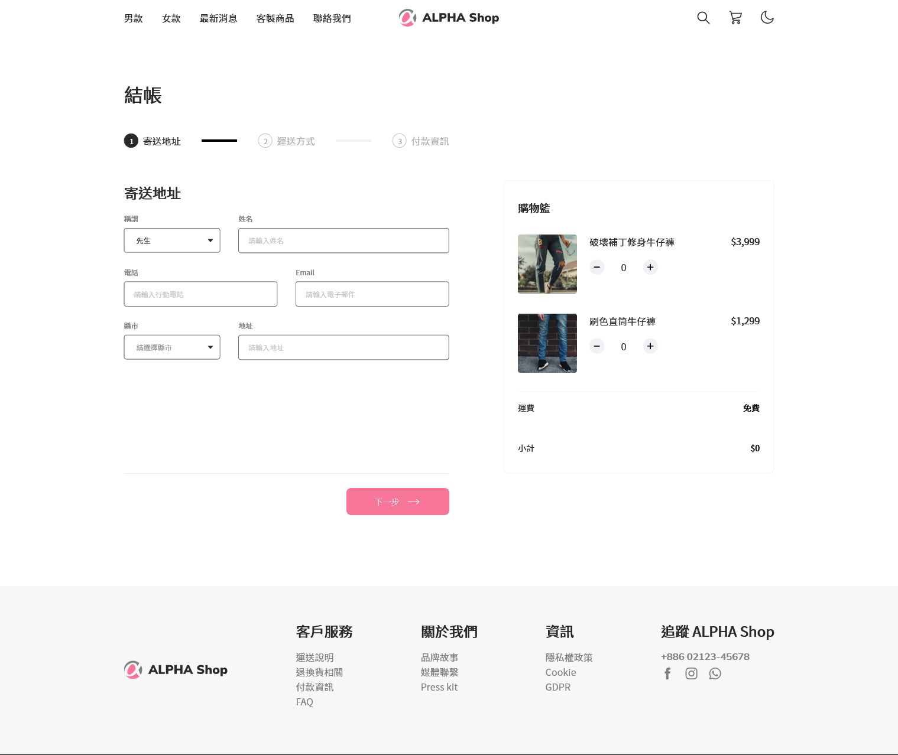
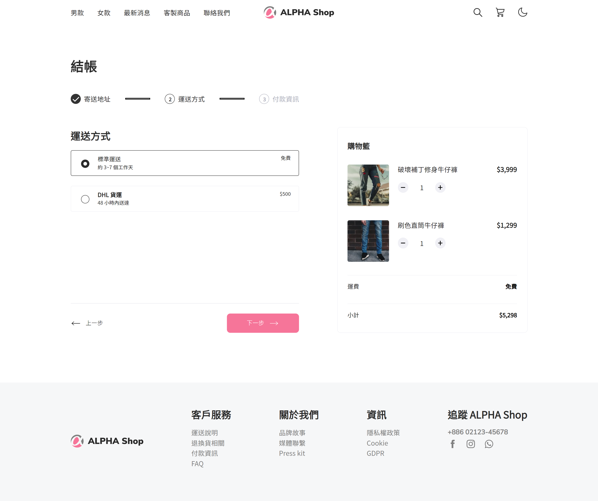

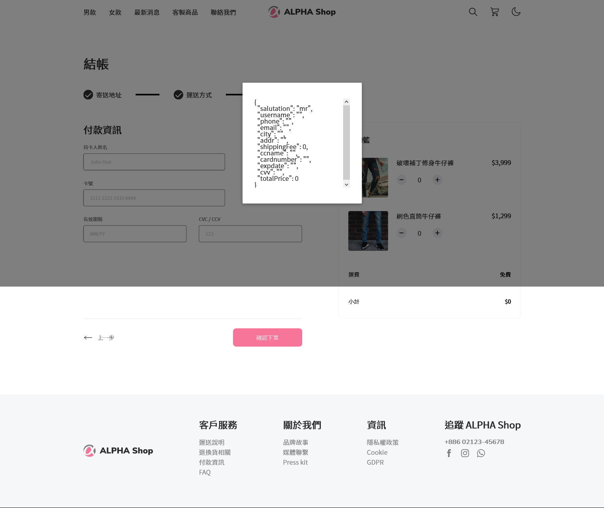
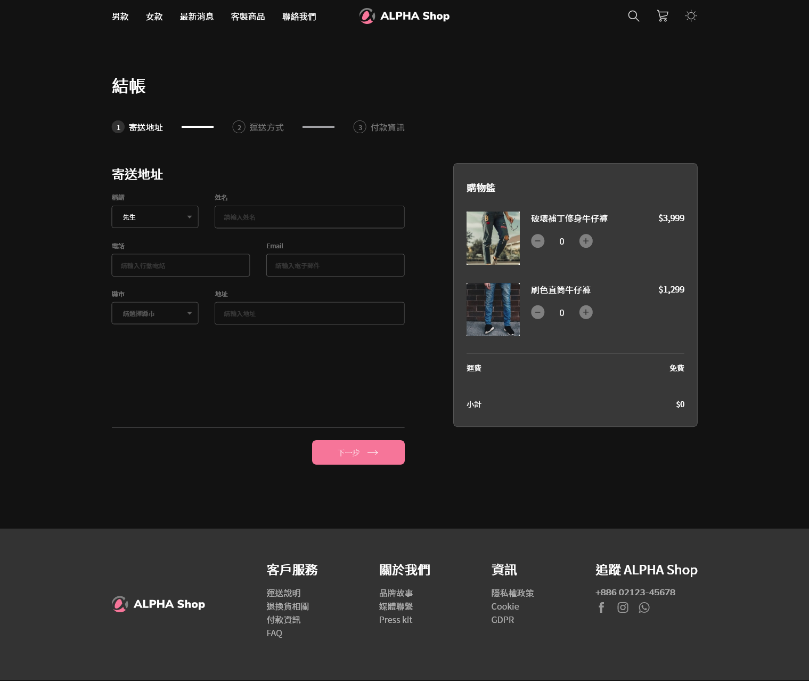
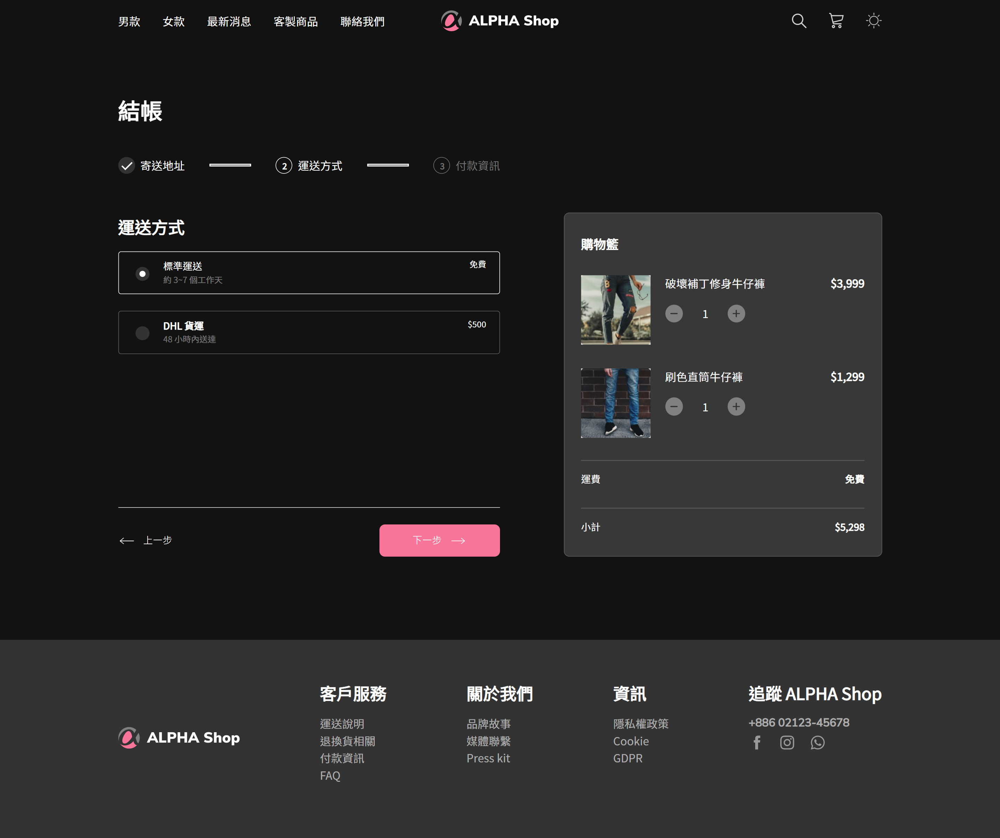
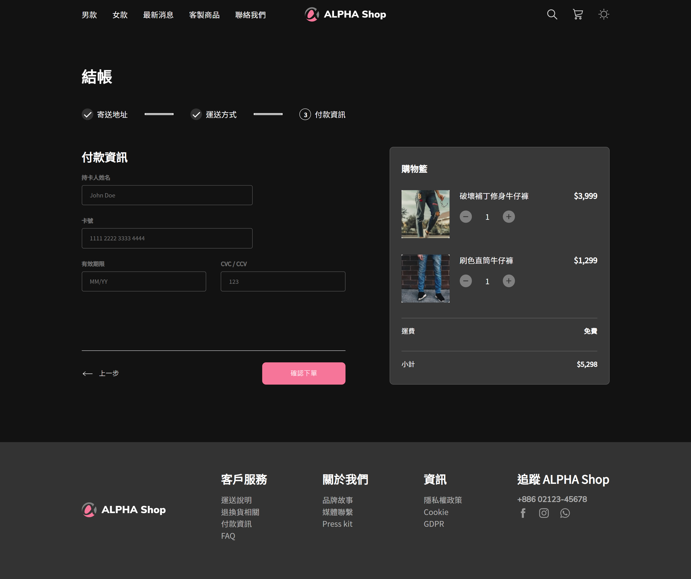
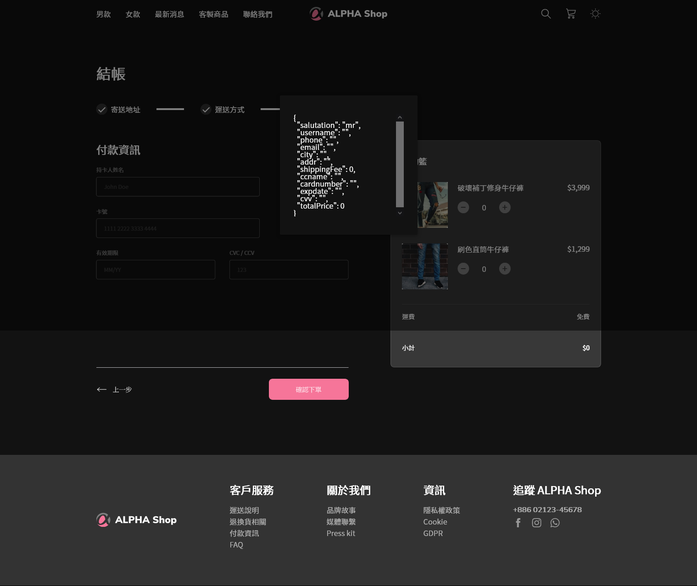
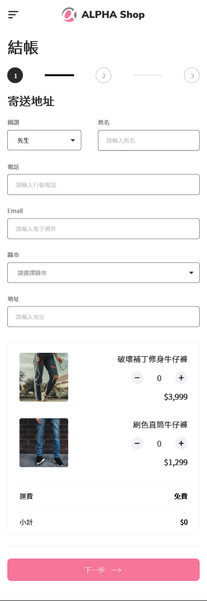
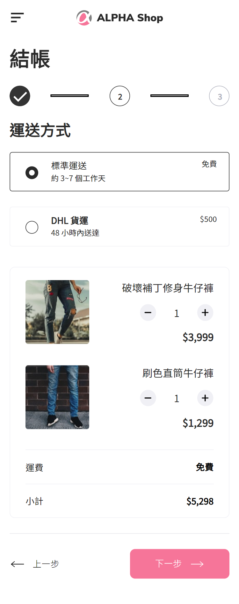
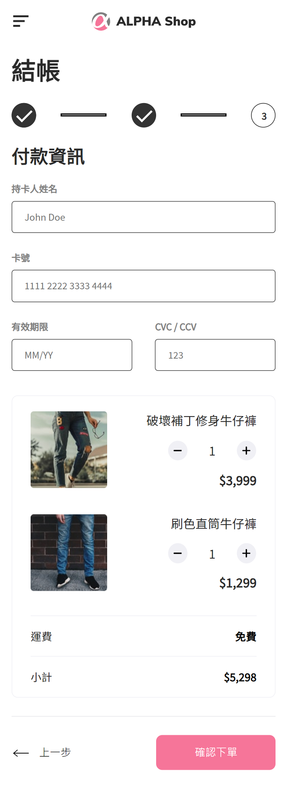
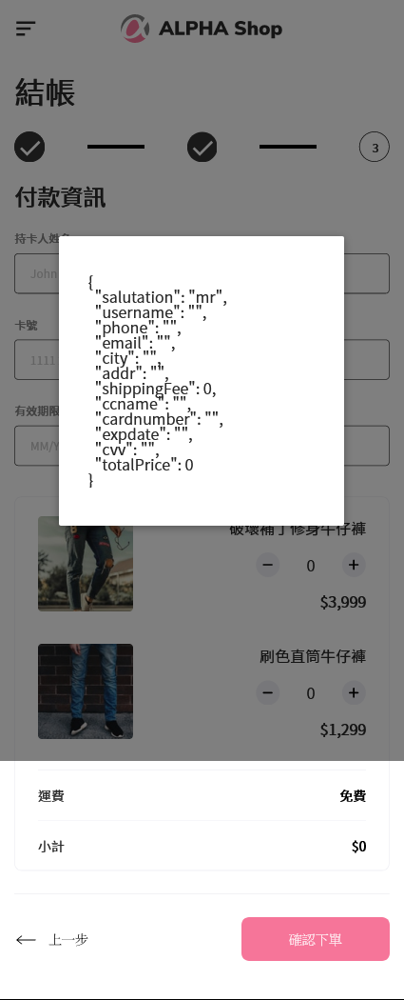
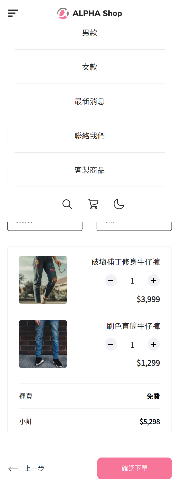
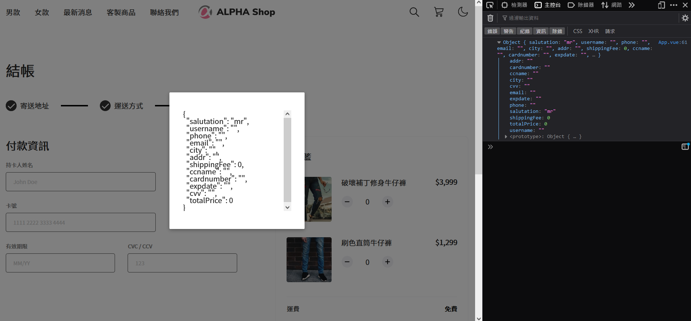

**reminder**: Modal is imeplemented by view height attritube, so the modal shadow won't cover the whole webpage but the whole browser window.
- - -

## This project is currently built on
* [JavaScript](https://developer.mozilla.org/en-US/docs/Web/JavaScript)
* [SASS/SCSS](https://sass-lang.com/)
* [Vue.js](https://vuejs.org/)
* [Vue CLI](https://cli.vuejs.org/)
* [Vue Router](https://router.vuejs.org/)
- - -

## Features of the project
* It supports desktop and mobile layout (display currently switchs on 749.9px)
* It supports theme switch (currently only light and dark theme available)
* Product item amount selection
* Total price calculation and display
* Show summary data on modal and console after confirmation
* Keep user input when page refreshed

- - -

## Project setup
```
npm install
```

### Compiles and hot-reloads for development
```
npm run serve
```

### Compiles and minifies for production
```
npm run build
```

### Lints and fixes files
```
npm run lint
```

### Customize configuration
See [Configuration Reference](https://cli.vuejs.org/config/).

- - -

## Project Directory Explanation
    /src               - root directory of source code
    /src/router        - router setting
    /src/views         - view files
    /src/components    - view component files
    /src/utils         - share functions
    /src/styles        - SCSS style
    /src/assets        - root directory of static files
    /src/assets/icons  - SVG icons
    /src/assets/images - pictures
    /public            - static resource
